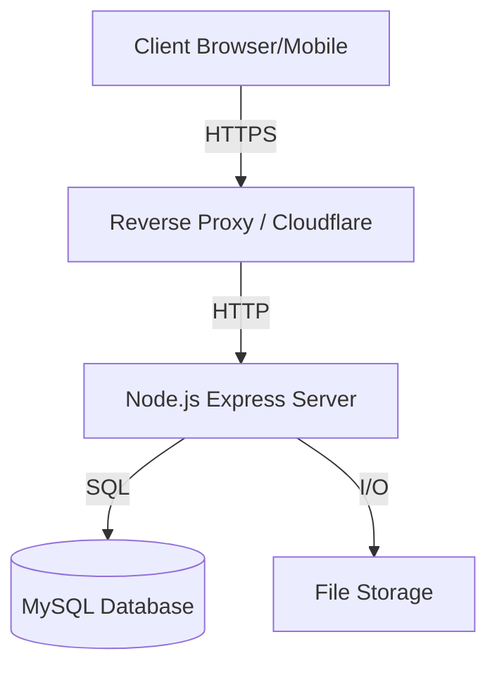

# Software Design Document (SDD)
# mahletay app store API Platform

**Version:** 1.0.0
**Date:** 2024-02-04
**Status:** Approved

---

## 1. Introduction

### 1.1 Purpose
The purpose of this document is to provide a comprehensive architectural and design overview of the **mahletay app store API Platform**. This platform serves as a centralized system for managing, distributing, and interacting with the Ethiopian Orthodox Hymn mobile application. It facilitates app version control, user feedback management, and community engagement through reviews and ratings.

### 1.2 Scope
The scope of the software system includes:
- **Admin Dashboard**: A restricted area for administrators to manage content, versions, and moderate user submissions.
- **Backend API**: A RESTful API serving both the web platform and (potentially) mobile clients.
- **Database**: A relational database for persistent storage of users, versions, reviews, and feedback.

### 1.3 Intended Audience
This document is intended for:
- **Developers**: For understanding the system architecture and code structure.
- **Project Managers**: For tracking features and requirements.
- **System Administrators**: For deployment and maintenance guidelines.
- **Stakeholders**: For high-level system understanding.

---

## 2. System Overview

### 2.1 High-Level Architecture
The system follows a typical **three-tier architecture**:
1.  **Presentation Layer (Frontend)**: React.js application serving as the UI for both public and admin users.
2.  **Application Layer (Backend)**: Node.js/Express.js server handling business logic, API requests, and security.
3.  **Data Layer (Database)**: MySQL database storing all application data.

### 2.2 Technology Stack

| Component | Technology | Rationale |
| :--- | :--- | :--- |
| **Frontend Framework** | React 18 (Vite) | Component-based, high performance, rich ecosystem. |
| **Styling** | CSS3 (Variables) | Custom "Sacred" design system, high personalization. |
| **Animations** | Framer Motion | Smooth, declarative animations for React. |
| **Backend Runtime** | Node.js (v18+) | Non-blocking I/O, scalable, unified JS stack. |
| **Web Framework** | Express.js | Minimalist, flexible, robust routing and middleware. |
| **Database** | MySQL (v8.0+) | Reliable relational data integrity, structured schema. |
| **ORM/Query** | MySQL2 (Driver) | High performance, prepared statements for security. |
| **Authentication** | JWT (JSON Web Token) | Stateless authentication, scalable. |

---

## 3. System Architecture

### 3.1 Component Diagram

### 3.2 Data Flow
1.  **Client Request**: User interacts with the React frontend.
2.  **API Call**: Frontend sends an HTTP request (GET/POST/PATCH/DELETE) via Axios to the API endpoint.
3.  **Authentication**: `auth.middleware.js` intercepts the request to verify JWT tokens for protected routes.
4.  **Validation**: `express-validator` middleware checks input sanitization and types.
5.  **Controller Logic**: The specific controller processes the business logic.
6.  **Database Interaction**: Models execute SQL queries using the connection pool.
7.  **Response**: The server sends a JSON response back to the client.

---

## 4. Database Design

### 4.1 Schema Overview
The database uses a normalized relational schema with the following core entities:

### 4.2 Entity Descriptions

#### `users`
Stores administrative user accounts.
- **Fields**: `id`, `username`, `email`, `password_hash`, `role`, `created_at`, `last_login`.
- **Security**: Passwords hashed using `bcrypt` (12 rounds).

#### `app_versions`
Manages APK releases.
- **Fields**: `id`, `version_number`, `version_name`, `changelog`, `file_path`, `is_active`.
- **Logic**: Only active versions are downloadable. `version_number` must be unique.

#### `reviews`
User-submitted text reviews for specific versions.
- **Fields**: `id`, `version_id`, `reviewer_name`, `review_text`, `is_approved`, `is_featured`.
- **Workflow**: Creating a review sets `is_approved` to false. Admin must approve.

#### `ratings`
Numeric ratings (1-5 stars).
- **Fields**: `id`, `version_id`, `rating`, `ip_address`.
- **Constraint**: Unique constraint on `(version_id, ip_address)` prevents spam.

#### `downloads`
Tracks download events for analytics.
- **Fields**: `id`, `version_id`, `ip_address`, `user_agent`, `downloaded_at`.

#### `feedback`
General user feedback system.
- **Fields**: `id`, `type` (bug/suggestion/blessing), `message`, `status`, `admin_response`.

---

## 5. Module Descriptions

### 5.1 Backend Modules

#### Authentication Module (`authController.js`)
- Handles Login/Logout.
- Issues JWT access tokens.
- Verifies session validity.

#### Version Control Module (`versionController.js`)
- **Public**: List versions, get latest, download file.
- **Admin**: Upload APK (using Multer), create version record, update/delete version.

#### Moderation Module (`reviewController.js`, `feedbackController.js`)
- Admin tools to view pending submissions.
- Approve/Reject/Feature reviews.
- Respond to feedback via email (simulated/stored).

### 5.2 Frontend Modules

#### UI Module (Design System)
- **Theme Engine**: Variables for Light/Dark mode.
- **Core Components**: Button, Card, Input, Modal.
- **Styles**: Custom CSS focusing on "Sacred" aesthetics (Gold/Beige palette).

#### Animation Module
- **Scroll Reveal**: Elements fade in upon scrolling into view.
- **Micro-interactions**: Hover states, magnetic buttons, loading spinners.
- **Parallax**: Background movement logic.

#### Admin Dashboard
- **Protected Routes**: Requires Valid JWT.
- **Data Visualization**: Stats for downloads, ratings distribution.
- **Management Tables**: Lists for Versions, Reviews, Feedback with actions.

---

## 6. Security Architecture

### 6.1 Authentication & Authorization
- **Access Control**: Role-Based (Admin, Moderator).
- **Token**: Bearer Token mechanism using `jsonwebtoken`.
- **Expiration**: Short-lived access tokens (7d), configurable.

### 6.2 Data Protection
- **Encryption**: Passwords are **never** stored in plain text.
- **Sanitization**: All inputs are validated/sanitized to prevent XSS.
- **Injection Protcetion**: All database queries use parameterized prepared statements.

### 6.3 Operational Security
- **Rate Limiting**:
    - Login: 5 attempts / 15 mins.
    - API General: 100 requests / 15 mins.
    - File Upload: 10 uploads / hour.
- **Headers**: `Helmet.js` sets secure HTTP headers (HSTS, No-Sniff, etc.).
- **CORS**: Restricted to trusted frontend domains.

---

## 7. Deployment & Maintenance

### 7.1 Requirements
- **Server**: 1 CPU, 512MB RAM minimum.
- **Storage**: SSD recommended for DB and File Uploads.
- **Environment**: Node 18+, MySQL 8+.

### 7.2 Configuration
Managed via `.env` files. Critical keys:
- `JWT_SECRET`: Must be high-entropy random string.
- `DB_PASSWORD`: Secure database credentials.
- `CORS_ORIGIN`: Domain of the frontend.

### 7.3 Backup Strategy
1.  **Database**: Daily `mysqldump` of `orthodox_hymn_db`.
2.  **Files**: Incremental backup of `backend/uploads/` directory.

---

## 8. User Interface Guidelines

### 8.1 Design Philosophy
The interface is designed to evoke a sense of **Sacredness, Peace, and Timelessness**.
- **Colors**: Gold (#D4AF37) represents divinity; Beige/Dark backgrounds represent tradition/focus.
- **Typography**: Serif fonts for headings for traditional feel; Sans-serif for readability.
- **Motion**: Slow, eased animations (300ms-600ms) to prevent jarring interactions.

### 8.2 Accessibility
- **Contrast**: Text/Background ratios compliant with WCAG AA.
- **Navigation**: Fully keyboard navigable.
- **Screen Readers**: Aria labels implemented on non-text interactive elements (icons).

---

**End of Document**
_Prepared by_ System Arcitect
